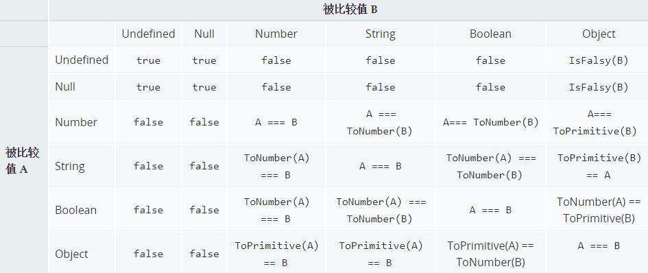

最近看到一道题

```js
![] == []
```

运行一下，可以看到答案为 true。归根结底这些都是 JavaScript 中的类型转换造成的奇怪的结果。关于 JavaScript 中 == 的计较规则，我再在网上我找到了一张图，看看看一下比较时的规则：



根据上面的图表，我们再来看下开始的题目，来看看结果是怎么来的。

1. 首先 `[]` 转换为 `true`, 取反变为 `false`。则题目变成如下：

```js
false == []
```

2. 变成了 Boolean 与 Object 的比较，根据规则，继续进行类型转换，ToNumber(Boolean) == ToPrimitive(Object)。那么题目变成：

```js
// false 转成 number 变为 0，[] 转为原始值，就是 ''
0 == ''
```

3. 变成了 Number 与 String 的比较，根据规则，继续进行类型转换，Number == ToNumber(String)。那么题目变成：

```js
// '' 转成 number 就是 0
0 == 0
```

4. 所以结果就为 true 了。

关于这类问题，还涉及到类型转换的问题，接下来详细了解一下问题。

### ToNumber

首先看一下其他数据类型是如何 转 Number 的：

| 原始值    | 转换结果                            |
| --------- | ----------------------------------- |
| undefined | NaN                                 |
| null      | 0                                   |
| true      | 1                                   |
| false     | 0                                   |
| String    | 根据语法转换规则进行转化            |
| Symbol    | Throw a TypeError exception         |
| Object    | 先调用 toPrimitive，再调用 toNumber |

#### StringToNumber

具体看一下 String 是如何 转 Number 的：

- 如果字符串中只包含数字，那么就转换为对应的数字
- 如果字符串中只包含十六进制格式，那么就转换为对应的十进制数字。
- 如果字符串为空，那么转换为 0。
- 如果字符串包含上述之外的字符，那么转换为 NaN。

### ToBoolean

再看一下其它数据类型是如何 转 Boolean 的：

| 原始值    | 转换结果                             |
| --------- | ------------------------------------ |
| undefined | false                                |
| null      | false                                |
| Number    | 0 和 NaN 返回 false，其他值返回 true |
| String    | '' 返回 false，其他值返回 true       |
| Symbol    | true                                 |
| Object    | true                                 |

### ToString

再看一下其它数据类型是如何转 String 的：

| 原始值    | 转换结果                               |
| --------- | -------------------------------------- |
| undefined | 'undefined'                            |
| null      | 'null'                                 |
| Boolean   | 'true' 或者 'false'                    |
| Number    | 对应的字符串                           |
| Symbol    | Throw a TypeError exception            |
| Object    | 先调用 toPrimitive，再调用 toPrimitive |

### ToPrimitive

在对象转原始类型时，一般会调用内置的 ToPrimitive 方法。具体的详细规则，参照 ECMA 规范，在这里用一份代码表示一下 ToPrimitive 是如何转换为原始类型的：

[ECMA ToPrimitive](https://tc39.es/ecma262/#sec-toprimitive)

```js
const getType = (obj) => {
  return Object.prototype.toString.call(obj).slice(8, -1)
}

const isPrimitive = (obj) => {
  const types = ['Undefined', 'Null', 'String', 'Number', 'Boolean']
  return types.indexOf(getType(obj)) !== -1
}

const toPrimitive = (input, preferredType) => {
  // 如果 input 是原始类型，则不需要转换，直接返回
  if (isPrimitive(input)) return input

  // preferredType 若为空，则为 default，否则为 number 或 string
  let hint = !preferredType ? 'default' : preferredType
  // Symbol 和 Data 内置的就有 @@toPrimitive 方法，可以转换为原始值
  let exoticToPrim = input.@@toPrimitive
  // 看要转换的值是否有 @@toPrimitive 方法，若有直接进行转换
  if (exoticToPrim) {
    const result = exoticToPrim(input, hint)
    if (isPrimitive(result)) {
      return result
    } else {
      throw new TypeError('TypeError execption')
    }
  }
  // 这里给了默认hint值为number，Symbol和Date通过定义@@toPrimitive方法来修改默认值
  if (hint === 'default') {
    hint = 'number'
  }

  return ordinaryToPrimitive(input, hint)
}

const ordinaryToPrimitive = (input, hint) => {
  let methodNames = null
  let result = null
  if (isPrimitive(input)) return

  if (hint === 'string') {
    methodNames = [input.toString, input.valueOf]
  } else {
    methodNames = [input.valueOf, input.toString]
  }

  for (let name in methodNames) {
    if (input[name]) {
      result = input[name]
      if (isPrimitive(result)) return result
    }
  }

  throw new TypeError('TypeError exception')
}
```

关于规范中中通过 hint 的值来确定 toString 和 valueOf 的调用顺序，之前还是存在疑问的。因为据我之前了解在对象 toString 和 valueOf 都存在的情况下，JavaScript 是盲目的选择 valueOf 方法来进行类型转换的。其实是如规范中所说，hint 值默认为 default 时，被转换成了 number, 所以会发现 JavaScript 盲目的选择 valueOf 方法来进行类型转换。但当我们使用模板字符串进行转换时，hint 值就为 string 了。可以看一下下面的例子：

```js
const obj = {
  toString: function () {
    return '[object MyObject]'
  },
  valueOf: function () {
    return 17
  },
}

'17' == obj // true
'17' == `${obj}` // false
```

### Symbol.toPrimitive

Symbol.toPrimitive 是一个内置的 Symbol 值，它是作为对象的函数值属性存在的，当一个对象转换为对应的原始值时，会调用此函数。

```js
const obj = {
  [Symbol.toPrimitive](hint) {
    if (hint === 'number') {
      return 42
    }
    if (hint === 'string') {
      return 'abc'
    }
    return null
  },
}

console.log(+obj) // 42
console.log(`${obj}`) // 'abc'
```

此外，该方法在类型转换的时候优先级最高，就如上面规范所说，Symbol.toPrimitive 相当于内置的 @@toPrimitive 方法。具体可以看一下：

```js
const obj = {
  toString() {
    return '1111'
  },
  valueOf() {
    return 222
  },
  [Symbol.toPrimitive]() {
    return 666
  },
}
console.log(1 + obj) // 667
console.log('1' + `${obj}`) // '1666'
```
