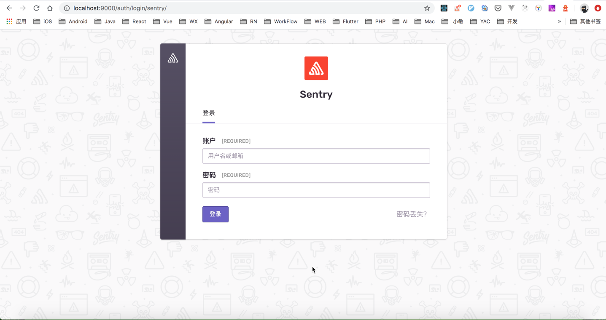
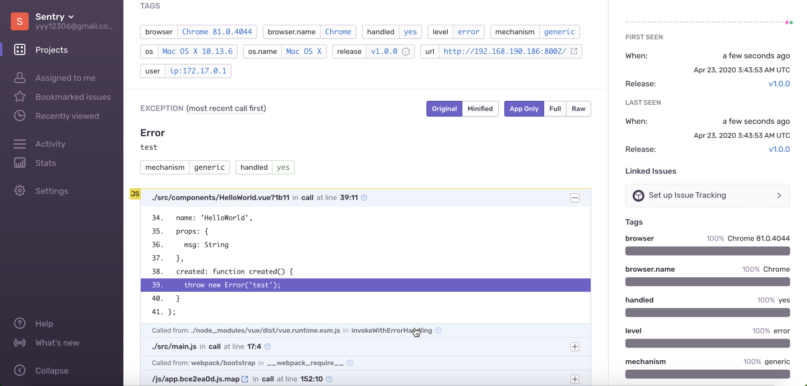

前面在 [前端异常监控](/front-end/exception-monitor-1586335615.html) 一文里大概了解了前端是如何进行异常监控的，但是要搭建一个完整的异常监控系统还是很麻烦的，不仅仅需要完善一下我们前端的异常监控代码，还需要单独开发一个异常管理系统。好在我们有现成的轮子可以使用，Sentry 是就是一个非常出色的服务，今天我们就来了解一下如何使用 Sentry 进行异常监控的。

### 创建前端项目

我们以 Vue 的项目为例，首先使用 `vue-cli` 创建一个项目

```bash
vue create hello-world
```

然后在在项目里手动抛出一个异常，以便后续异常上报。

在 `/src/components/HelloWorld.vue` 文件第 40 行抛出一个错误：


### 注册

我们可以使用 Sentry 提供的在线服务来帮助我们进行异常监控。首先我们需要注册一个帐号，[注册地址](https://sentry.io/signup)


如上图所示，填写姓名、组织、邮箱、密码后就可以了。

### 创建 Sentry 项目

创建一个 Sentry 非常简单，只需要选中我们想要类型的项目就可以了：


### 前端项目相关配置

按照创建完项目后 Sentry 的提示，在我们的 Vue 项目中进行配置即可：

- 安装 `@sentry/browser`

```bash
# Using npm
$ npm install @sentry/browser

# Using yarn
$ yarn add @sentry/browser
```

- 安装 `@sentry/integrations`

```bash
# Using npm
$ npm install @sentry/integrations --save

# Using yarn
$ yarn add @sentry/integrations
```

- 在 `/src/main.js` 中添加代码

```js
import * as Sentry from '@sentry/browser';
import { Vue as VueIntegration } from '@sentry/integrations';

Sentry.init({
  dsn: 'https://66ed9457c0e5405397f465b4f9223aa1@o381494.ingest.sentry.io/5208892', // 创建项目后会生成 dsn
  integrations: [new VueIntegration({Vue, attachProps: true})],
});
```

OK，配置完成。

### 开发环境

启动我们的项目，然后打开我们的前端页面。

```bash
npm run serve
```

打开控制台，发现浏览器并没有打印我们的错误，可见 Sentry 已经捕获到错误了。 若需要浏览器在控制台打印错误，可通过设置 `integrations` 的 `logErrors` 选项为 `true`。

然后看一下我们的 Sentry 项目管理页面，可以看到已经收集到异常了：


点开错误详情看一下：


可以看到，错误信息收集的十分完整，不仅有错误的堆栈信息，还有浏览器环境相关信息等等。

现在已经可以愉快的收集异常了，是不是非常简单 ~~

### 生产环境

生产环境中我们的代码肯定都是经过压缩的，那我们看一下在生产环境中，Sentry 的表现是怎样的。可以本地通过 docker 启动一个 nginx 服务来部署我们的代码，这里就不详细介绍了。项目部署之后，再去看一下我们收集到的异常详细信息：


只能看到错误发生在哪个组件的生命周期钩子里，错误的堆栈信息是代码压缩后的代码堆栈信息，这对我们对错误进行定位就不是很方便了，为了解决这个问题，我们需要把webpack打包生成的 js 文件以及 sourceMap 文件上传到 Sentry 上面，这样，Sentry 就能够帮助我们准确定位了。

我们需要做以下操作：

#### 1. 安装 @sentry/webpack-plugin

```bash
# Using npm
$ npm install --save-dev @sentry/webpack-plugin

# Using yarn
$ yarn add --dev @sentry/webpack-plugin
```

#### 2. 修改 webpack 配置 和 release 相关版本配置

- 新增 `/src/settings.js` 文件，方便进行 release 版本管理。

```js
module.exports = {
  version: 'v1.0.0',
}
```

- 在 `/src/main.js` 中初始化 Sentry 时添加 release 相关配置。

```js
import settings from './settings.js'

Sentry.init({
  release: settings.version,
  dsn: 'https://66ed9457c0e5405397f465b4f9223aa1@o381494.ingest.sentry.io/5208892', // 创建项目后会生成 dsn
  integrations: [new VueIntegration({Vue, attachProps: true, logErrors: process.env.NODE_ENV === "production" ? false : true})],
});
```

- 新增 `.sentryclirc` 文件

```code
[defaults]
url=https://sentry.io/
org=org
project=org

[auth]
token=token
```

对文件中的参数进行一下说明：

使用 Sentry 在线服务的话，url 设置为 `https://sentry.io/`

org 和 project 可按下图进行配置：


token 按以下步骤获取：

1. 点击红框标出的 setting


2. 点击红框标出的 Auth Tokens


3. 点击红框标出的 Create New Token


4. 选中 project:write


5. 复制 token 到 `.sentryclirc` 文件中


- 新增 `vue.config.js` 文件

```js
"use strict";
const SentryCliPlugin = require("@sentry/webpack-plugin");
const settings = require("./src/settings.js");

module.exports = {
  configureWebpack: {
    plugins: [
      new SentryCliPlugin({
        release: settings.version,
        include: "./dist",
        ignore: ["node_modules", "vue.config.js"],
      }),
    ],
  },
};
```

#### 3. 重新打包部署

执行打包命令:

```bash
npm run build
```

可以在命令行中看到我们上传了打包后生成的 js 文件 和 map 文件：


上传后的文件可以在 Sentry 的管理页面中 Releases 相关版本详情中看到：


部署后，刷新页面，然后进入到 error 详情中查看，如下：


发现可以精准的对错误信息进行定位，完美 ~~

### 私有化部署

如果企业内部使用的话，私有化部署还是很有必要的。接下来我们就使用 Docker 部署一个 Sentry 服务

#### 1. 启动Redis容器

```bash
docker run -d --name sentry-redis redis
```

#### 2. 启动 Postgres 容器

```bash
docker run -d --name sentry-postgres -e POSTGRES_PASSWORD=secret -e POSTGRES_USER=sentry postgres
```

#### 3. 生成所有 Sentry 容器共享的密钥

```bash
export SECRET_KEY=$(docker run --rm sentry config generate-secret-key|tail -n 1)
```

#### 4. 如果这是一个新数据库，则需要运行 upgrade

```bash
docker run -it --rm -e SENTRY_SECRET_KEY=${SECRET_KEY} --link sentry-postgres:postgres --link sentry-redis:redis sentry upgrade
```

输入邮箱、密码 创建用户。

#### 5. 启动 Sentry 容器

```bash
docker run -d -p 9000:9000 --name my-sentry -e SENTRY_SECRET_KEY=${SECRET_KEY} --link sentry-redis:redis --link sentry-postgres:postgres sentry
```

#### 6. 启动调度器和 worker

```bash
docker run -d --name sentry-cron -e SENTRY_SECRET_KEY=${SECRET_KEY} --link sentry-postgres:postgres --link sentry-redis:redis sentry run cron

docker run -d --name sentry-worker-1 -e SENTRY_SECRET_KEY=${SECRET_KEY} --link sentry-postgres:postgres --link sentry-redis:redis sentry run worker
```

### 使用本地 Sentry 服务

依次执行命令后，没有问题的话就可以访问 `http://localhost:9000` 来看一下我们部署的 Sentry 服务了。页面与 Sentry 的在线服务有些区别，但操作流程基本一样。



登陆成功后，新建一个项目，然后修改一下配置：

#### 1. 在 `/src/main.js` 中修改 dsn

```js
import * as Sentry from '@sentry/browser';
import { Vue as VueIntegration } from '@sentry/integrations';

Sentry.init({
  dsn: 'http://7b4af4c05ee84328a2497b4493bacc74@localhost:9000/3', // 创建项目后会生成 dsn
  integrations: [new VueIntegration({Vue, attachProps: true})],
});
```

#### 2. 重新生成 token 并修改 `.sentryclirc` 文件

```code
[defaults]
url=http://localhost:9000
org=sentry
project=vue-exception-monitor

[auth]
token=037bf45801df4404b410dcc224768c907d5f09f1d9b8496e9228507371bd105d
```

然后重新部署 Vue 项目，测试一下：



可以看到我们本地部署的 Sentry 服务，也能帮我们收集异常了。完美 ~~
