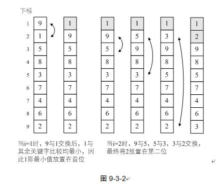
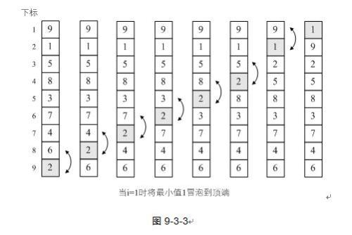

先来看一下冒泡排序的基本思想：

> 冒泡排序（Bubble Sort）是一种交换排序，它的基本思想是：两两比较相邻记录的关键字，如果反序则交换，这倒没有反序的记录为止。

## 最简单排序实现

接下来看下最简单的排序代码：

```java
public class BubbleSort {

    public static void main(String[] args) {
        int[] ary = {9, 1, 5, 8, 3, 7, 4, 6, 2};

        bubleSort(ary);

        for (int i = 0; i < ary.length; i++) {
            System.out.println(ary[i]);
        }
    }

    static void bubleSort(int[] list) {
        int len = list.length;
        for (int i = 0; i < len; i++) {
            for (int j = i + 1; j < len; j++) {
                if (list[i] > list[j]) {
                    int temp = list[i];
                    list[i] = list[j];
                    list[j] = temp;
                }
            }
        }
    }

}
```

但这段代码，严格意义上来上并不算是标准的冒泡排序，因为它不满足“两两比较相邻记录”的冒泡排序思想，它应该是最最简单的交换排序而已。它的思路就是让每一个关键字，都与他后面的每一个关键字比较，如果大则交换，这样第一位置的关键字在依次循环后一定变成最小值。假设我们待排序的关键字序列为{9, 1, 5, 8, 3, 7, 4, 6, 2}，排序过程如下图所示：



但是这种排序是有缺陷的。在排序好 1 和 2 的位置后，对其余关键字的排序并没有什么帮助（数字 3 反而还被换到了最后一位）。
也就是说，这个算法的效率是非常低的。

## 冒泡排序算法

让我们看看正宗的排序算法

```java
public class BubbleSort {

    public static void main(String[] args) {
        int[] arr = {9, 1, 5, 8, 3, 7, 4, 6, 2};

        bubleSort(arr);
        for (int i = 0; i < arr.length; i++) {
            System.out.println(arr[i]);
        }

    }

    static void bubleSort(int[] list) {
        int len = list.length;
        for (int i = 0; i < len; i++) {
            // 注意 j 是从后往前循环
            for (int j = len - 2; j >= i; j--) {
                if (list[j] > list[j + 1]) {
                    int temp = list[j];
                    list[j] = list[j + 1];
                    list[j + 1] = temp;
                }
            }
        }
    }

}
```

依然假设我们待排序的关键字为{9, 1, 5, 8, 3, 7, 4, 6, 2}，当 i = 1 时，排序过程如下：



在第一次循环中，我们还将关键字 2 从第 9 排到了第 3 的位置，显然这种算法比前面的算法要有进步。图中较小的数字如同气泡般慢慢浮到上面，因此就将此算法命名为冒泡算法。

我们也可以让 j 从前往后遍历，前后两两比较时，仍然是较小数字向上冒泡，只不过在第一次循环后，最大的数字 9 排在了最后面，代码如下（回想起来，笔者第一次学习冒泡排序就是这个样子的）：

```java
public class BubbleSort {

    public static void main(String[] args) {
        int[] arr = {9, 1, 5, 8, 3, 7, 4, 6, 2};

        bubleSort(arr);
        for (int i = 0; i < arr.length; i++) {
            System.out.println(arr[i]);
        }

    }

    static void bubleSort(int[] list) {
        int len = list.length;
        for (int i = 0; i < len; i++) {
            // 注意 j 是从后往前循环
            for (int j = 0; j < len - 1 - i; j++) {
                if (list[j] > list[j + 1]) {
                    int temp = list[j];
                    list[j] = list[j + 1];
                    list[j + 1] = temp;
                }
            }
        }
    }

}
```

## 冒泡排序优化

这样的冒泡排序是否还可以优化呢？答案是肯定的。假设待排序的序列为 {2, 1, 3, 4, 5, 6, 7, 8, 9}，也就是说，除了第一和第二位的关键字需要交换外，别的都已经是正常的顺序。当 i = 1 时，交换了 2 和 1，此时序列已经有序，但是算法扔不依不饶地将 i = 2 到 9 以及 j 中循环都执行了一遍，尽管没有进行交换，但之后的比较还是多余了。

当 i = 2 时，我们已经可以发现没有数据需要交换，这是就说明序列已经有序，不需要进行后续的判断了。因此我们可以这样改进：

```java
public class BubbleSort {

    public static void main(String[] args) {
        int[] arr = {2, 1, 3, 4, 5, 6, 7, 8, 9};

        bubleSort(arr);
        for (int i = 0; i < arr.length; i++) {
            System.out.println(arr[i]);
        }

    }

    static void bubleSort(int[] list) {
        boolean flag = true;
        int len = list.length;
        for (int i = 0; i < len && flag; i++) {
            flag = false;
            // 注意 j 是从后往前循环
            for (int j = len - 2; j >= i; j--) {
                if (list[j] > list[j + 1]) {
                    flag = true; // 如果有数据交换，则 flag 为 true
                    int temp = list[j];
                    list[j] = list[j + 1];
                    list[j + 1] = temp;
                }
            }
        }
    }

}
```

代码改动的关键就在 i 的 for 循环中，增加了对 flag 是否为 true 的判断。经过这样的改进，冒泡排序在性能上就有了一定的提升，可以避免在已经有序的情况下的无意义循环判断。

## 冒泡排序复杂度分析

在改进后的代码情况下，在最好的情况下，也就是要排序的表本身就是有序的，那么我们只需进行 n - 1 次比较，时间复杂度为 O(n)。在最坏的情况下，即待排序表为逆序的情况，此时需要比较 (n - 1) + ... + 3 + 2 + 1 = n \* (n - 1) / 2 次，因此总的时间复杂度为 O(n<sup>2</sup>)。

## 参考

[《大话数据结构》](https://book.douban.com/subject/6424904/)
