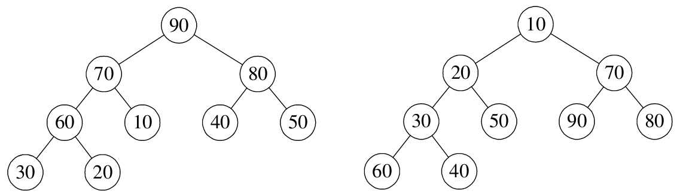
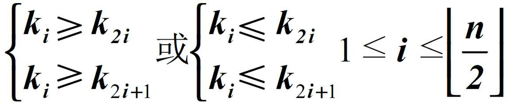
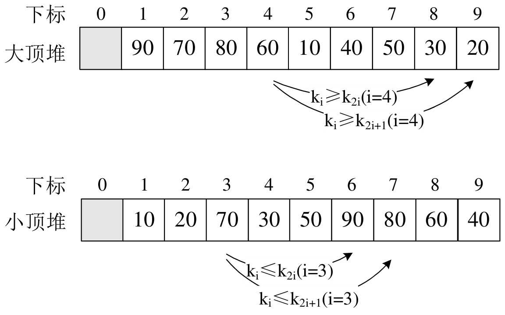
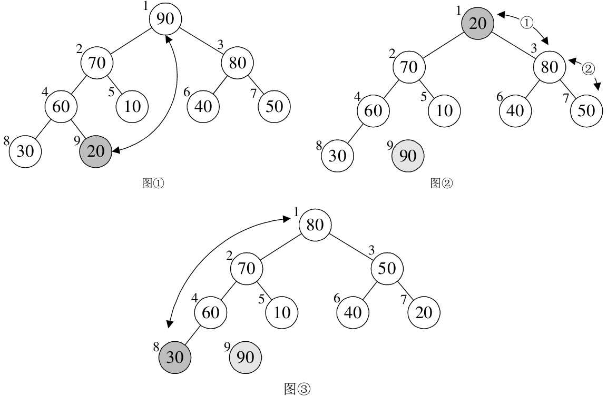
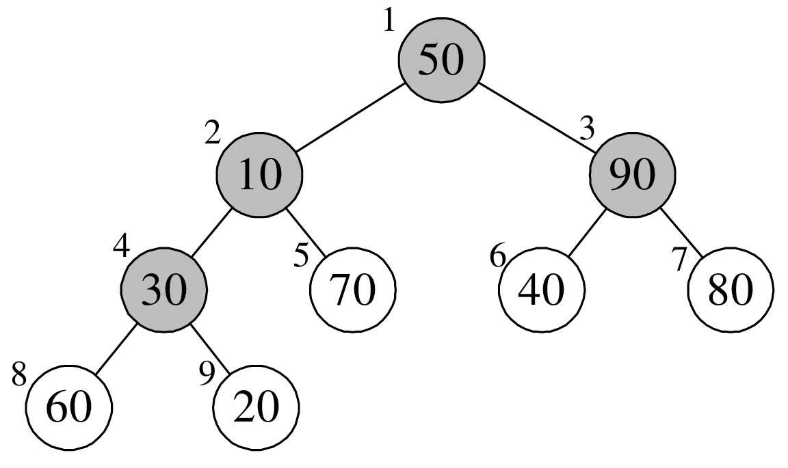
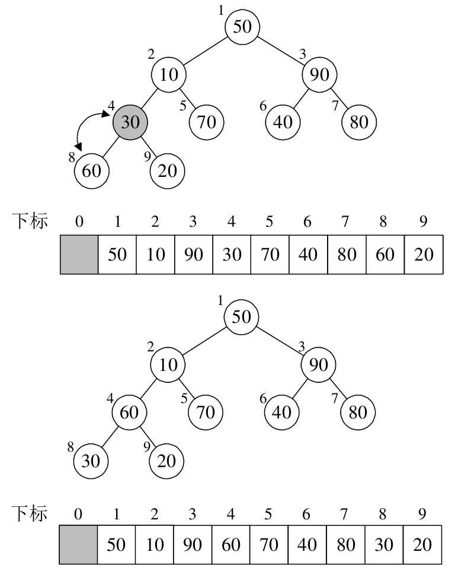
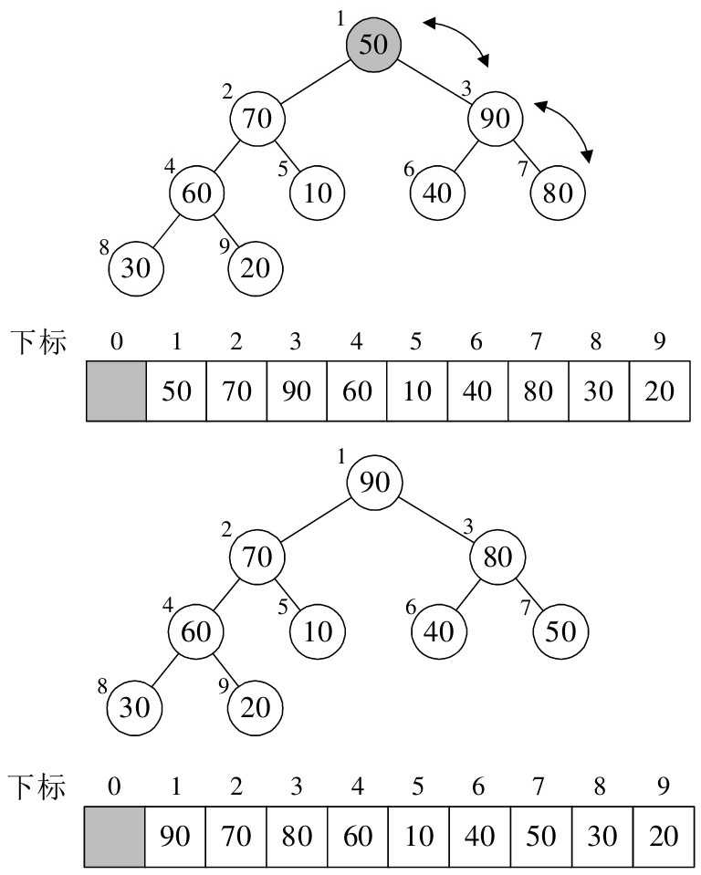
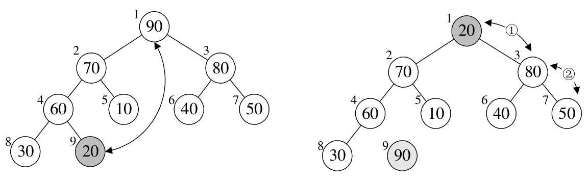
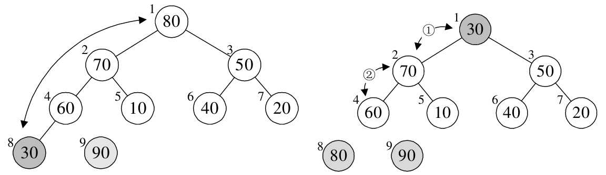
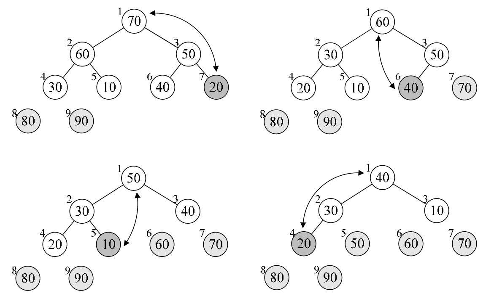

堆是具有下列性质的完全二叉树：每个节点的值都大于或等于其左右孩子节点的值，称为大顶堆；或者每个节点的值都小于或等于其左右孩子节点的值，称为小顶堆，如下图所示：



按照层序遍历的方式给节点从 1 开始编号，节点之间满足如下关系：



将大顶推和小顶堆用层序遍历存入数组：



堆排序（Heap Sort）就是利用堆（假设利用大顶堆）进行排序的算法。它的基本思想是：将待排序的序列构造成一个大顶堆。此时，整个序列的最大值就是堆顶的根节点。将它移走（其实就是将其与堆数组的末尾元素进行交换，此时末尾元素就是最大值），然后将剩余的 n - 1 个序列重新构成一个堆，这样就会得到 n 个元素中的次大值。如此反复执行，便能得到一个有序序列了。具体如下图所示：



实现需要解决两个问题：

- 如何由一个无序序列构建成一个堆
- 如何在输出堆顶元素后，调整剩余元素成为一个新的堆

假设要排序的序列是 {50,10,90,30,70,40,80,60,20}，构成一个完全二叉树如下图所示：



将待排序的序列构建成为一个大顶堆，就是从下往上、从右到左（即按照图中
4→3→2→1 的顺序），将每个非终端结点（非叶结点）当作根结点，将其和其子树调整成大顶堆。

来看看 Java 中的实现：

```java
/**
  * 堆调整函数
  *
  * @param arr    待排序数组 {50,10,90,30,70,40,80,60,20}
  * @param i      根节点下标 {3, 2, 1, 0}
  * @param length 数组长度 9
  */
void heapAdjust(int[] arr, int i, int length) {
    // 先取出当前元素 i
    int temp = arr[i];
    // 从i结点的左子结点开始，也就是2i+1处开始
    for (int k = i * 2 + 1; k < length; k = k * 2 + 1) {
        // 如果左子结点小于右子结点，k指向右子结点
        if (k + 1 < length && arr[k] < arr[k + 1]) {
            k++;
        }
        // 如果子结点大于父节点，将子结点值赋给父节点（不用进行交换）
        if (arr[k] > temp) {
            arr[i] = arr[k];
            i = k;
        } else {
            break;
        }
    }
    //将temp值放到最终的位置
    arr[i] = temp;
}
```

- 可以看到按照从下往上、从右到左，第一个根节点的下标为 3（arr.length / 2 - 1），值为 temp = 30；进入 for 循环，k = 7，该左子结点的下标为 7（i \* 2 + 1），值为 60；大于右子结点的值（20），则将其值赋给根结点，arr[3] = arr[7] = 60，i = 7。k = 15，跳出循环。arr[7] = temp = 30。完成了 arr[3] 与 arr[7] 的交换，即完成了根结点与其左子结点的交换。如下图所示：


- 下个根结点下标为 2，值为 temp = 90；进入 for 循环，该左子结点的下标为 k = 5，其值小于右子结点，右子结点为 arr[6] = 80 < temp，因此跳出循环。
- 下个根结点下标为 1，值为 temp = 10；进入 for 循环，该左子结点的下标为 k = 3，其值小于右子结点，右子结点为 arr[4] = 70 > temp，因此将其值赋给根结点，arr[1] = arr[4] = 70。最终本次调用使得 10 与 70 进行了互换。如下图所示：



- 下个根结点下标为 0，值为 temp = 50；进入 for 循环，该左子结点的下标为 k = 1，其值小于右子结点，右子结点为 arr[2] = 90 > temp，因此将其值赋给根结点，arr[0] = arr[2] = 90。i = 2,该左子结点的下标为 k = 5，再次进入循环，其值小于右子结点，右子结点为 arr[6] = 80 > temp，将其值赋给根结点，arr[2] = arr[6] = 80。最后结束循环。此时已经构成了大顶堆，如下图所示：



接下来来看下完整代码实现：

```java
import java.util.Arrays;

public class HeapSort {

    public static void main(String[] args) {
        int[] arr = {50, 10, 90, 30, 70, 40, 80, 60, 20};
        System.out.println("排序前：" + Arrays.toString(arr));
        heapSort(arr);
        System.out.println("排序前：" + Arrays.toString(arr));
    }


    static void heapSort(int[] arr) {
        // 1.构建大顶堆
        for (int i = arr.length / 2 - 1; i >= 0; i--) {
            //从第一个非叶子结点从下至上，从右至左调整结构
            heapAdjust(arr, i, arr.length);
        }
        // 2.调整堆结构 + 交换堆顶元素与末尾元素
        for (int j = arr.length - 1; j > 0; j--) {
            // 将堆顶元素与末尾元素进行交换
            swap(arr, 0, j);
            // 重新对堆进行调整
            heapAdjust(arr, 0, j);
        }
    }

    static void heapAdjust(int[] arr, int i, int length) {
        // 先取出当前元素i
        int temp = arr[i];
        // 从i结点的左子结点开始，也就是2i+1处开始
        for (int k = i * 2 + 1; k < length; k = k * 2 + 1) {
            // 如果左子结点小于右子结点，k指向右子结点
            if (k + 1 < length && arr[k] < arr[k + 1]) {
                k++;
            }
            // 如果子节点大于父节点，将子节点值赋给父节点（不用进行交换）
            if (arr[k] > temp) {
                arr[i] = arr[k];
                i = k;
            } else {
                break;
            }
        }
        //将temp值放到最终的位置
        arr[i] = temp;
    }

    static void swap(int[] arr, int a, int b) {
        int temp = arr[a];
        arr[a] = arr[b];
        arr[b] = temp;
    }

}
```

来看一下构建大顶推之后的排序过程：

- j = 8，arr[0] 与 arr[8] 进行了交换，之后重新构建大顶堆，如下图所示：



- j = 7，arr[0] 与 arr[7] 进行了交换，之后重新构建大顶堆，如下图所示：



- 后面的变化：



## 堆排序复杂度分析

推排序的运行时间主要是消耗在初始构建堆和在重建堆时的反复筛选上。

在构建推的过程中，因为是完全二叉树从最下层最右边的非终端结点开始构建，将它与其孩子进行比较和若有必要的互换，对于每个非终端结点，最多进行两次比较和互换操作，时间复杂度为 O(n)。

正式排序：第 i 次取堆顶记录重建堆需要用 O(log i)的时间（完全二叉树的某个结点到根结点的距离为[log i] + 1，并且需要取 n-1 次堆顶记录，因此重建堆的时间复杂度为 O(nlogn)。

总体堆排序的时间复杂度为 O(nlogn)。

空间复杂度上只有一个用来交换的暂存单元，也非常的不错。不过由于记录的比较与交换是跳跃式进行，堆排序也是一种不稳定的排序方法。由于初始构建堆所需的比较次数较多，不适合待排序序列个数较少的情况。
