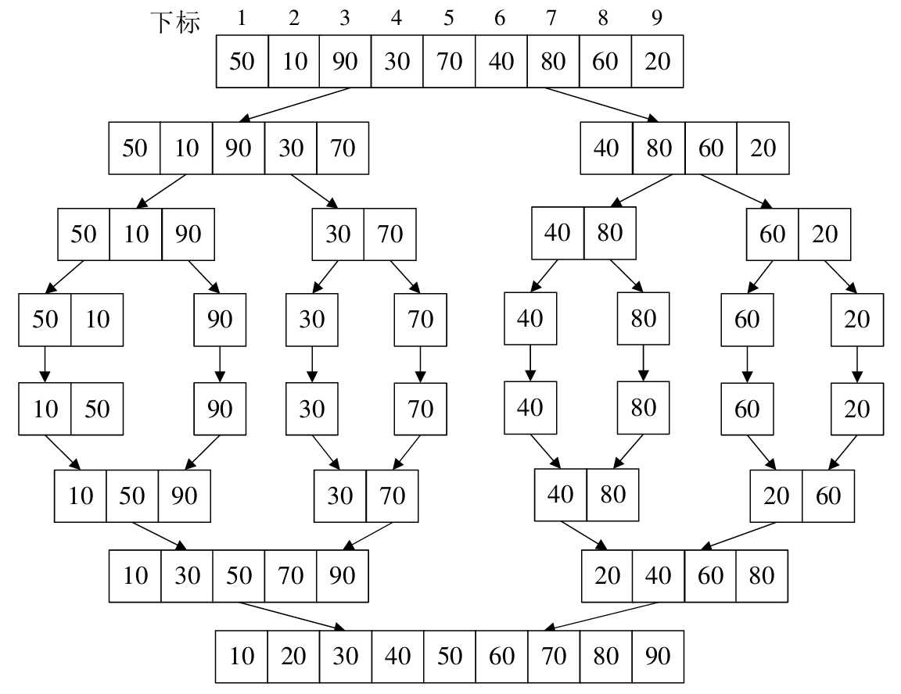

> 归并，在数据结构中，是指将两个或两个以上的有序表组合成一个新的有序表

归并排序（Merging Sort）就是利用归并的思想实现的排序方法。它的原始是假设初始序列含有 n 个记录，则可以看成是 n 个有序的子序列，每个子序列的长度为 1，然后两两归并，得到 n / 2（|x|表示不小于 x 的最小整数）个长度为 2 或 1 的有序子序列；再两两归并，如此重复，直至得到一个长度为 n 的有序序列为止，这种排序方法称为 2 路归并排序

来看下代码：

```java
public class MergeSort {

    public static void main(String[] args) {
        int[] arr = {50, 10, 90, 30, 70, 40, 80, 60, 20};

        mergeSort(arr, 0, arr.length - 1);
        for (int i = 0; i < arr.length; i++) {
            System.out.println(arr[i]);
        }

    }

    public static void mergeSort(int[] a, int start, int end) {
        // 当子序列中只有一个元素时结束递归
        if (start == end) {
            return;
        }

        // 划分子序列
        int mid = (start + end) / 2;
        // 对左侧子序列进行递归排序
        mergeSort(a, start, mid);
        // 对右侧子序列进行递归排序
        mergeSort(a, mid + 1, end);
        //合并
        merge(a, start, mid, end);
    }

    // 两路归并算法，两个排好序的子序列合并为一个子序列 {50, 10} , 0, 0, 1
    public static void merge(int[] a, int left, int mid, int right) {
        int[] tmp = new int[a.length];
        // p1、p2是检测指针，k是存放指针
        int p1 = left, p2 = mid + 1, k = left;

        while (p1 <= mid && p2 <= right) {
            if (a[p1] <= a[p2]) {
                tmp[k++] = a[p1++];
            } else {
                tmp[k++] = a[p2++];
            }
        }

        // 如果第一个序列未检测完，直接将后面所有元素加到合并的序列中
        while (p1 <= mid) {
            tmp[k++] = a[p1++];
        }

        //同上
        while (p2 <= right) {
            tmp[k++] = a[p2++];
        }


        //复制回原素组
        for (int i = left; i <= right; i++) {
            a[i] = tmp[i];
        }
    }
}
```

来直接看下整个数据变换示意图：



## 归并排序复杂度分析

无论在什么情况下，归并排序的时间复杂度都是 O(nlogn)。

归并排序是一种比较占用内存，但却效率高且稳定的算法。
